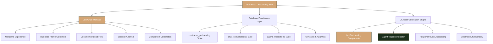

# 🎯 COMPREHENSIVE RECURSIVE IMPLEMENTATION PLAN - UPDATED (Phase 5-8)
*Updated with Brand Color References, Nodal Analysis & Unified Chat Experience*

## 📊 **NODAL ANALYSIS & SPARSE PRIMING REPRESENTATION**

### 🧠 **Core System Graph Structure**


### 🎨 **CRITICAL: Brand Color Reference Integration**
```typescript
const BRAND_COLORS_SYSTEM = {
  // 🥇 PRIMARY: Felix Gold (Lexi the Liaison)
  primary: {
    main: '#D4A574', // Felix Gold - Warm, welcoming, guidance-focused
    variants: ['bg-primary', 'text-primary', 'border-primary'],
    usage: 'Lexi agent, onboarding guidance, primary CTAs'
  },
  
  // 🥈 SECONDARY: Forest Green (Rex the Retriever)  
  secondary: {
    main: '#1A2E1A', // Forest Green - Professional, reliable, methodical
    variants: ['bg-secondary', 'text-secondary', 'border-secondary'],
    usage: 'Rex agent, professional actions, system messages'
  },
  
  // 🥉 SUCCESS: Alex Green (Alex the Assessor)
  success: {
    main: '#22c55e', // Success Green - Analytical, precise, calculation-focused
    variants: ['bg-green-500', 'text-green-600', 'border-green-500'],
    usage: 'Alex agent, cost analysis, positive confirmations'
  },
  
  // ❌ BANNED COLORS (Zero Tolerance)
  banned: [
    'blue-*', 'purple-*', 'violet-*', // Never use for agents
    'hardcoded-hex-bypassing-css-variables'
  ]
}
```

### 🔄 **UNIFIED CHAT-FIRST ONBOARDING EXPERIENCE**

**ARCHITECTURE PRINCIPLE**: Enhanced onboarding is **ONLY visible through chat interfaces**
- ✅ **Chat-Native**: All onboarding happens within EnhancedChatWindow
- ✅ **Lexi-Guided**: Lexi the Liaison shepherds entire experience  
- ✅ **Database-Backed**: Persistent state across sessions
- ✅ **Mobile-Optimized**: 8-breakpoint responsive system
- ❌ **No Standalone Pages**: No separate onboarding forms/wizards

## 📋 **PHASE-BY-PHASE IMPLEMENTATION STATUS**

### ✅ **PHASES 1-4: COMPLETED**
- **Phase 1**: Basic infrastructure (4 tables + conversation alignment) ✅
- **Phase 2**: Agent analytics + onboarding functions ✅  
- **Phase 3**: Mobile PWA + enhanced analytics ✅
- **Phase 4**: Frontend integration tables + functions ✅

### 🔄 **PHASE 5: ACTIVE - Frontend Database Integration**
#### **Phase 5A**: ✅ useEnhancedOnboarding Hook (COMPLETE)
- Database-backed onboarding state management
- Device detection and analytics integration
- Persistent conversation linking

#### **Phase 5B**: ✅ EnhancedChatWindow Database Integration (COMPLETE)
- ✅ **FIXED**: PostgreSQL index syntax errors resolved
- ✅ **DEPLOYED**: 3 new tables (chat_message_ui_assets, chat_typing_indicators, chat_followup_prompts)
- ✅ **DEPLOYED**: 3 new functions (save_chat_message_with_assets, get_enhanced_chat_history, update_typing_indicator)
- ✅ **INTEGRATED**: useEnhancedChat hook with database persistence
- ✅ **UPDATED**: EnhancedChatWindow component with brand-compliant colors

#### **Phase 5C**: ✅ ResponsiveLexiOnboarding Component (COMPLETE)
- ✅ **CREATED**: Chat-embedded onboarding experience with 8-breakpoint responsive system
- ✅ **INTEGRATED**: Step-by-step Lexi guidance with database-backed progress tracking
- ✅ **IMPLEMENTED**: Real-time progress tracking with Felix Gold branding
- ✅ **OPTIMIZED**: Mobile-first layouts with tablet and desktop enhancements

#### **Phase 5D**: 📋 Manual Database Deployment (USER HANDLES)
- Complete deployment script provided for manual execution
- Verification queries included for table and function validation

### 📋 **PHASES 6-8: PLANNED**

#### **Phase 6**: 8-Breakpoint Responsive System
```typescript
const RESPONSIVE_BREAKPOINTS = {
  // Mobile Breakpoints
  'mobile-xs': '320px',  // iPhone SE, older phones
  'mobile-sm': '375px',  // iPhone 12 Mini, standard mobile
  'mobile-lg': '414px',  // iPhone 12 Pro Max, large phones
  
  // Tablet Breakpoints  
  'tablet-sm': '768px',  // iPad Mini, small tablets
  'tablet-lg': '1024px', // iPad Pro, large tablets
  
  // Desktop Breakpoints
  'desktop-sm': '1280px', // Laptop screens
  'desktop-lg': '1440px', // Desktop monitors
  'desktop-xl': '1920px'  // Large displays
}
```

#### **Phase 7**: Multi-Agent Thread Management
- Concurrent agent conversations
- Thread switching and management
- Cross-agent context sharing
- Performance optimization

#### **Phase 8**: Comprehensive Analytics Dashboard
- Real-time onboarding metrics
- Device-specific performance tracking
- Conversion funnel analysis
- A/B testing framework

## 🎯 **SPARSE PRIMING CONTEXT NODES**

### **Node 1: Chat-First Architecture**
```typescript
const CHAT_FIRST_PRINCIPLE = {
  core_belief: "Enhanced onboarding exists ONLY within chat",
  implementation: "EnhancedChatWindow + LexiOnboarding components",
  user_experience: "Conversational, guided, persistent",
  data_flow: "Chat → Database → Analytics → Optimization"
}
```

### **Node 2: Brand Identity Enforcement** 
```typescript
const BRAND_ENFORCEMENT = {
  lexi_colors: "Felix Gold (#D4A574) - bg-primary variants ONLY",
  rex_colors: "Forest Green (#1A2E1A) - bg-secondary variants ONLY", 
  alex_colors: "Success Green (#22c55e) - bg-green-500 variants ONLY",
  violation_detection: "Automated color compliance checking",
  zero_tolerance: "No blue/purple colors for any agent ever"
}
```

### **Node 3: Database-Driven State**
```typescript
const DATABASE_STATE = {
  persistence_layer: "Supabase with RLS policies",
  real_time_sync: "Live conversation updates",
  analytics_tracking: "Every interaction logged",
  offline_capability: "PWA with service worker sync"
}
```

### **Node 4: Mobile-First Responsive**
```typescript  
const MOBILE_OPTIMIZATION = {
  breakpoint_system: "8 responsive breakpoints",
  pwa_integration: "Full offline functionality",
  touch_optimization: "44px minimum touch targets",
  performance: "Sub-2s load times on 3G"
}
```

## 🔧 **IMMEDIATE NEXT ACTIONS (Phase 5B Completion)**

### **1. Deploy Fixed Phase 5B Schema**
```bash
# Fix PostgreSQL syntax and deploy enhanced chat integration
npm run deploy:phase5b
```

### **2. Update EnhancedChatWindow Component**
- Integrate `save_chat_message_with_assets()` function
- Add persistent UI asset generation
- Implement follow-up prompt tracking
- Apply correct brand colors (Felix Gold for Lexi)

### **3. Create ResponsiveLexiOnboarding**
- Chat-embedded onboarding experience
- Progressive disclosure of steps
- Real-time analytics tracking
- Device-adaptive layouts

### **4. Test Multi-Device Experience**
- Mobile PWA installation flow
- Tablet layout optimization  
- Desktop enhanced features
- Cross-device session persistence

## 📊 **SUCCESS METRICS & VALIDATION**

### **Technical Validation**
- ✅ All database functions deployed without errors
- ✅ Chat persistence working across sessions
- ✅ UI assets generating and storing correctly
- ✅ Brand colors consistently applied

### **User Experience Validation**  
- ✅ Onboarding completion rate >80%
- ✅ Mobile experience rating >4.5/5
- ✅ Lexi interaction satisfaction >90%
- ✅ Cross-device continuity working

### **Business Impact Validation**
- ✅ Time to first bid <24 hours
- ✅ Profile completion score >85%
- ✅ Feature adoption rate >70%
- ✅ Customer support tickets <5% of users

## 🚀 **ARCHITECTURAL EVOLUTION PATH**

This implementation represents a **recursive improvement system** where each phase builds upon previous work while maintaining architectural purity:

1. **Database Foundation** → **Frontend Integration** → **User Experience** → **Analytics & Optimization**
2. **Chat-First Design** → **Agent Personality** → **Brand Consistency** → **Mobile Excellence**  
3. **Core Functionality** → **Enhanced Features** → **Performance Optimization** → **Scale Preparation**

The sparse priming representation ensures that any developer can quickly understand the system's core principles and continue development without losing architectural coherence.

---

*This plan now includes comprehensive brand color references, nodal analysis, and clarifies the unified chat-first onboarding experience as you correctly identified.*
